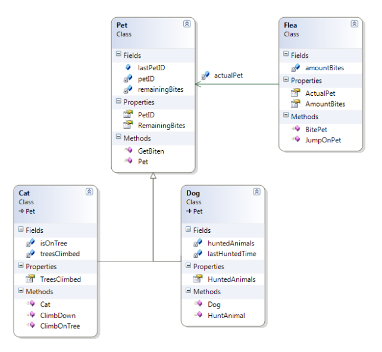

# PetsAndFleas - Flohsimulator

Fuer einen Flohsimulator sollen Sie folgende Klassen implementieren: Hund (Dog), Katze
(Cat), Floh (Flea). Zusaetzlich sollen Sie eine Klasse Pet entwerfen, von welcher die Klassen
Cat und Dog erben.
Im Pet sind jene Dinge umzusetzen, die sowohl fuer Katze als auch Hund gelten. Ausserdem
kann ein Floh sowohl auf eine Katze als auch einen Hund springen. Deshalb werden wir den
Floh 'allgemein' auf ein Objekt der Klasse Pet springen lassen.

## Details

**Klasse Pet:**

* Jedes Tier soll ein internes Feld petID und die zugehörige ReadOnly-Property (PetID)
besitzen. Diese ID soll automatisch im Konstruktor der Klasse Pet vergeben werden.
Jedes Tier bekommt die nächst größere Nummer. Hinweis: Verwende ein statisches
Klassenattribut lastPetID (mit ReadOnly-Property)!

* Jedes Tier kann maximal 100 mal von einem Floh gebissen werden. Die noch
mögliche Bissanzahl soll in dem Feld (mit ReadOnly-Property) remainingBites
verwaltet werden.

* Eine öffentliche Methode int GetBiten(int amount): Wird aufgerufen wenn das Tier
von einem Floh gebissen wird. Parameter amount ist die Anzahl der Bisse die der Floh
versucht durchzuführen. Max. gesamte Bissanzahl beachten! Rückgabewert sind die
tatsächlich möglichen Bisse.

**Klasse Cat:**

* Jede Katze ist ein Haustier (Pet) -> Vererbung.

* Zusätzlich kann eine Katze auf Bäume klettern: Die Anzahl wie oft die jeweilige Katze
bereits auf einem Baum war soll im Feld (mit ReadOnly-Property) treesClimbed
gespeichert werden.

* Hierzu gibt es zwei öffentliche Methoden: ClimbOnTree (Katze klettert auf einen Baum)
und ClimbDown (Katze klettert hinunter). Beachte! Bevor die Katze auf einen weiteren
Baum klettern kann, muß sie vorher hinunterklettern. Geben Sie jeweils „true“ zurück,
wenn die aktuelle Bewegung zulässig ist, sonst „false“.

**Klasse Dog:**

* Jeder Hund ist ein Haustier (Pet) -> Vererbung.

* Zusätzlich kann ein Hund jemanden Nachjagen. Die Anzahl wie oft der Hund bereits
versucht hat etwas zu jagen soll im Feld (mit ReadOnly-Property) huntedAnimals
gespeichert werden.

* Hierzu gibt es die öffentliche Methode: HuntAnimal. Beachte! Der Hund muss
zwischen zwei Jagdversuchen mindestens eine Sekunde pausieren. Sonst wird false
zurückgegeben und huntedAnimals nicht erhöht.

**Klasse Flea:**

* Ein Floh kann auf einem Haustier sitzen. Das Haustier soll im Feld (mit ReadOnlyProperty) actualPet gespeichert werden.

* In dem Feld mit (ReadOnly-Property) amountBites soll gespeichert werden, wieviele
Bisse der jeweilige Floh bereits durchgeführt hat.

* Öffentliche Methode: JumpOnPet(Pet pet) lässt den Floh auf das übergebene Tier
springen.

* Öffentliche Methode: BitePet(int amount) lässt den Floh das aktuelle Tier beißen.
Hinweis: Methode GetBiten in Klasse Pet verwenden. Rückgabewert ist die Anzahl
der tatsächlich durchgeführten Bisse.

